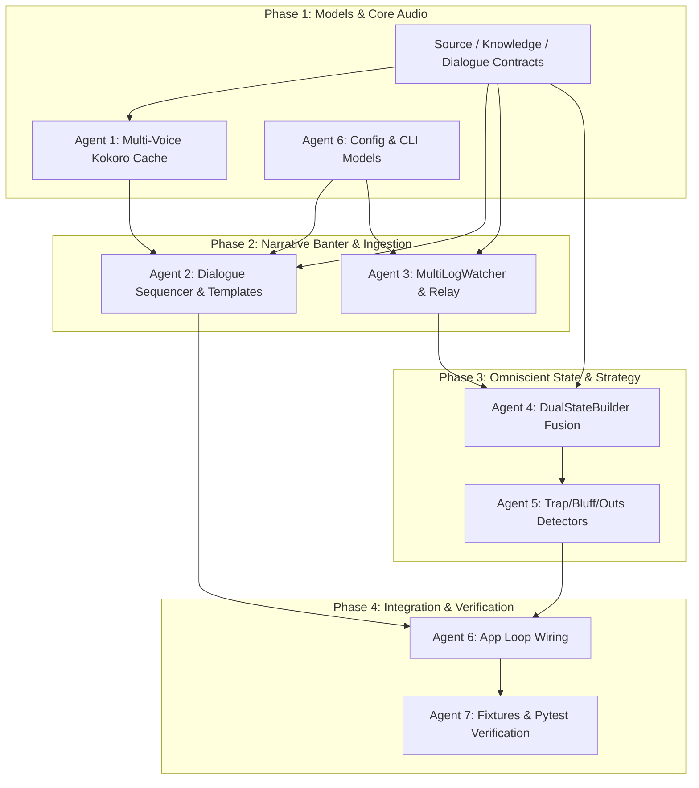

# ArenaOnAir — Dual Expansions Implementation Plan: Dual-Voice Conversational Booth & Omniscient Dual-Log Ingestion

**Document Version:** 1.2  
**Target Date:** 2026-09-21  
**Author:** Antigravity Architect  
**Auditor / Reviewer:** Astra  
**Orchestration Lead:** Hermes (Swarm Execution)  
**Target Repository:** `arenaonair` (`/Volumes/repos/arenaonair`)  

**Implementation prerequisite:** Complete the confirmed-bug remediation in [Section 7](#7-phase-0--confirmed-implementation-bugs-hermes-fix-backlog) before beginning the expansions. Section 7 updates the execution order and verification requirements below.

**Feature review and clarified scope:** [Section 8](#8-feature-review-corrections-and-single-log-first-requirements) incorporates all seven expansion-review findings and the user's requirement that one log is sufficient. Sections 7–8 govern implementation where earlier diagrams or examples omit details. Two commentators and two log sources are independent options.

---

## 1. Executive Summary & Mission Scope

This plan specifies the architecture and implementation roadmap for the two defining expansions of the **ArenaOnAir** broadcast shoutcaster platform:

1. **Dual-Voice Conversational Broadcast Booth**:
   - Upgrading from a single solo caster into a two-person broadcast desk: **Play-by-Play Shoutcaster (PBP)** and **Color Analyst / Strategist (Analyst)**.
   - Dynamic call-and-response banter, natural co-caster handoff timing (150ms–250ms cadence), excitement-driven interruptions, and warm-cached multi-voice Kokoro TTS routing.
2. **Dual-Player Log Ingestion & Omniscient State Fusion ("God-View")**:
   - Broadcasting from one `Player.log` stream, with optional enrichment from a second player in the same match through local file tailing or LAN/WebSocket relay.
   - Reconciling GRE state messages into a unified view with explicit visibility, freshness, and completeness per player. Both hands and decklists may become available when supported by synchronized source data; two connected sources do not guarantee complete knowledge.
   - Enriching commentary with supported cross-player tactical context and outs analysis while retaining normal single-log commentary whenever a second source is absent or unusable.

### Architectural Invariants & Non-Negotiables
- **Zero Regressions**: Existing single-log (`--log-path`) and single-voice (`--voice`) workflows must remain 100% backwards-compatible and test-passing.
- **One Log Is Sufficient**: A healthy single source supports the full broadcast loop and either solo or dual-voice commentary. Startup and continued narration must never depend on a second source. A configured but missing second file or relay client is a supported operating condition.
- **Independent Options**: Booth mode controls commentator roles; ingestion configuration controls available sources. Losing enrichment must not change a dual booth into a solo booth.
- **No LLM in Critical Path**: All conversational banter, call-and-response handoffs, and omniscient reactions are deterministic, template-driven, and compute in $< 15\text{ms}$.
- **Audio Delivery Guarantee**: Unconfirmed speech is logged loudly; match/game boundaries (`PRESERVED_KINDS`) are never pruned.
- **Warm Voice Switching**: Keep configured Kokoro voices warm so role changes do not reload models or voice assets. Measure audible handoff latency separately from voice-selection overhead.
- **Graceful Source Degradation**: If either source lags, disconnects, or loses state continuity, continue from the healthy source and disable only commentary that requires unavailable knowledge. Restore enrichment after validated resynchronization, without replaying public events.

---

## 2. Architecture & Data Flow Blueprints

### 2.1 Broadcast Booth & Ingestion Pipeline Overview

This diagram illustrates the enriched two-source path. With one source, the same event, dialogue, queue, and speech stages operate from its coherent partial-knowledge state; the second input and cross-player private enrichment are optional.

```
┌─────────────────────────────────────────────────────────────────────────────────────────────┐
│                                 INGESTION & NETWORKING                                      │
│                                                                                             │
│  [Player 1 Log / Stream] ───┐                                                               │
│                             ├──▶ [MultiLogTailer / WebSocketRelay] ──▶ [GRE Parser]         │
│  [Player 2 Log / Stream] ───┘                                               │               │
└─────────────────────────────────────────────────────────────────────────────┼───────────────┘
                                                                              ▼
┌─────────────────────────────────────────────────────────────────────────────────────────────┐
│                                  STATE & DETECTOR ENGINE                                    │
│                                                                                             │
│  GRE Messages ──▶ [DualStateBuilder] ──▶ [Omniscient GameState]                             │
│                         │                ├─ Seat 1 Hand (Revealed)                          │
│                         │                ├─ Seat 2 Hand (Revealed)                          │
│                         │                └─ Both Libraries (Tracked)                        │
│                         ▼                                                                   │
│                  [EventDiffer + Story] ──▶ Proactive Strategic Events                       │
│                                            ├─ TRAP_ARMED / TRAP_SPRUNG                      │
│                                            ├─ BLUFF_DETECTED                                │
│                                            └─ CLASH_OF_OUTS                                 │
└─────────────────────────────────────────────────────────────────────────────┼───────────────┘
                                                                              ▼
┌─────────────────────────────────────────────────────────────────────────────────────────────┐
│                                  NARRATIVE & DIALOGUE BOOTH                                 │
│                                                                                             │
│  Events ──▶ [DialogueSequencer]                                                             │
│                    │                                                                        │
│                    ├─ Anchor Call (PBP)       ──▶ Utterance(role="pbp", voice=v_pbp)        │
│                    └─ Tactical Analysis (Color) ──▶ Utterance(role="analyst", voice=v_color)│
│                                 │                                                           │
│                                 ▼                                                           │
│                    [SpeechQueue + Pacing Arbiter]                                           │
│                    • Co-caster handoff gap: 180ms                                           │
│                    • Inter-play breathing room: 800ms - 1500ms                              │
└─────────────────────────────────────────────────────────────────────────────┼───────────────┘
                                                                              ▼
┌─────────────────────────────────────────────────────────────────────────────────────────────┐
│                                     SPEECH SYNTHESIS                                        │
│                                                                                             │
│  SpeechPump ──▶ [ChainedSpeaker] ──▶ [Kokoro Multi-Voice Synthesizer]                       │
│                                      ├─ Warm Tensor Cache: voice_pbp (e.g. am_adam)         │
│                                      └─ Warm Tensor Cache: voice_analyst (e.g. am_onyx)     │
└─────────────────────────────────────────────────────────────────────────────────────────────┘
```

### 2.2 Omniscient State Fusion Mechanics

The example assumes validated shared identifiers, synchronized snapshots, complete deck accounting, and resolved card metadata. Real inputs must satisfy Section 8's prerequisites; otherwise publish supported partial knowledge and continue broadcasting.

```
Player A Log (Seat 1 Client):
  • Hand: [id=101 (Lightning Bolt), id=102 (Counterspell)]  <-- Visible
  • Seat 2 Hand: [id=201 (cardId=0), id=202 (cardId=0)]     <-- Hidden Fog of War
  • Seat 1 Decklist: Ingested via deckMessage (60 cards)

Player B Log (Seat 2 Client):
  • Seat 1 Hand: [id=101 (cardId=0), id=102 (cardId=0)]     <-- Hidden Fog of War
  • Hand: [id=201 (Sheoldred), id=202 (Swamp)]              <-- Visible
  • Seat 2 Decklist: Ingested via deckMessage (60 cards)
                          │
                          ▼
            [DualStateBuilder Reconciliation]
  • Matches on identical GRE gameStateId & turnInfo
  • Copies CardRef details for Seat 1 from Log A
  • Copies CardRef details for Seat 2 from Log B
                          │
                          ▼
             Omniscient GameState:
  • Seat 1 Hand: [Lightning Bolt, Counterspell]
  • Seat 2 Hand: [Sheoldred, the Apocalypse, Swamp]
  • Seat 1 Remaining Library: 48 cards (3 Lightning Bolt remaining)
  • Seat 2 Remaining Library: 49 cards (2 Cut Down remaining)
```

---

## 3. Deep Technical Specifications

### 3.1 Data Models & Interfaces ([`src/arenaonair/models.py`](file:///Volumes/repos/arenaonair/src/arenaonair/models.py))

Update frozen models with backwards-compatible optional defaults:

The snippets below are additive sketches. Section 8.1 also requires source/session identity, GRE state identity, freshness, and knowledge-completeness contracts before implementation. `is_omniscient` is a derived status, not a replacement for those fields and not a prerequisite for ordinary commentary.

```python
# In models.py:

@dataclass(frozen=True)
class GameState:
    snapshot_id: int
    prev_snapshot_id: int | None
    zones: Mapping[str, ZoneView]
    objects: Mapping[int, CardRef]
    players: Mapping[int, PlayerView]
    turn_info: TurnInfo
    match_meta: MatchMeta
    local_seat: int | None = None
    player_deck: tuple[int, ...] = ()
    commander_cards: tuple[int, ...] = ()
    # Dual-Log Omniscient Additions:
    player_decks: Mapping[int, tuple[int, ...]] = field(default_factory=dict)
    commander_cards_by_seat: Mapping[int, tuple[int, ...]] = field(default_factory=dict)
    is_omniscient: bool = False

@dataclass(frozen=True)
class Utterance:
    uid: str
    match_id: str | None
    kind: str
    text: str
    salience: int
    ts_created: float
    tempo: str = "normal"               # deliberate | normal | fast | frenzy
    excitement: str = "normal"          # calm | normal | tense | electric
    rate: float = 1.0                   # speed multiplier
    voice: str | None = None            # per-utterance voice override
    role: str = "play_by_play"          # "play_by_play" | "color_analyst"
    dialogue_id: str | None = None      # links banter pairs (anchor call <-> reaction)
```

---

### 3.2 Dual-Voice Broadcast Booth & Dialogue Sequencer

#### Role Personas & Voice Catalog
Commentary desks are configured with complementary vocal profiles selected from the application's Kokoro voice catalog:

| Preset Name | Play-by-Play Voice | Color Analyst Voice | Broadcast Style |
| :--- | :--- | :--- | :--- |
| **`sports_desk` (Default)** | `am_adam` (Crisp athletic male) | `am_onyx` (Deep analytical male) | Modern ESPN / Esports live tournament |
| **`mixed_duo`** | `af_heart` (Warm, rapid-fire female) | `am_adam` (Punchy sports male) | Dynamic co-caster stadium broadcast |
| **`premier_pro_tour`**| `am_michael` (Sharp play-caller) | `bm_george` (Tactical British male) | Formal Magic Pro Tour / Worlds main stage |
| **`academic_tactical`**| `bm_lewis` (Structured British male)| `bf_emma` (Articulate British female)| Deep strategic theory & deck equity focus |

#### Turn-Taking & Banter Cadence
Located in [`pacing.py`](file:///Volumes/repos/arenaonair/src/arenaonair/pacing.py) and [`speech.py`](file:///Volumes/repos/arenaonair/src/arenaonair/speech.py):
1. **The Anchor Call**: Play-by-play narrator reports the physical play (`CAST`, `ATTACK_DECLARED`, `BOARD_SHIFT`).
2. **The Color Handoff**: For selected high-salience events or tactical/narrative milestones, generate an optional Analyst companion with `role="color_analyst"`. Use only facts supported by the current source knowledge. The reply becomes eligible after successful anchor delivery and expires if its anchor fails, is canceled, or its supporting state becomes obsolete. Dual-role commentary works with one log.
3. **Conversational Timing**:
   - `handoff_gap`: **$180\text{ms} - 220\text{ms}$** (simulating quick conversational pickup between broadcast partners).
   - `play_gap`: **$800\text{ms} - 1500\text{ms}$** (normal breathing room between distinct plays).
4. **Dialogue Categories in `templates.py`**:
   - `ANALYST_AGREE`: *"Spot on, and look at the mana they tapped to do it."*
   - `ANALYST_DOUBT`: *"I don't know about that line, Adam—they're playing right into a sweeper."*
   - `ANALYST_TACTICAL`: *"That's their last piece of removal. Their shields are completely down."*
   - `ANALYST_EXCLAMATION`: *"What a read! Total game changer."*

#### Kokoro Warm Multi-Voice Synthesizer ([`src/arenaonair/platform/tts.py`](file:///Volumes/repos/arenaonair/src/arenaonair/platform/tts.py))
- `KokoroEngine` loads and caches the voice embedding tensors for both `voice_pbp` and `voice_analyst` during startup.
- Role changes reuse loaded voice assets and the model. Existing per-utterance voice routing should be reused. Voice selection is not an audible latency guarantee: account for synthesis and playback startup, with cancellable synthesis lookahead where necessary (Section 8.6).

---

### 3.3 Dual-Player Log Ingestion & Networking ([`src/arenaonair/relay.py`](file:///Volumes/repos/arenaonair/src/arenaonair/relay.py) & [`src/arenaonair/watcher.py`](file:///Volumes/repos/arenaonair/src/arenaonair/watcher.py))

#### Ingestion Topologies
Single-log operation remains the baseline. In every topology, one healthy source is sufficient; the second is optional enrichment. File labels and relay connection IDs are source identifiers, not proof of the GRE player's seat.

1. **Local Dual-File Mode** (`--log-player1 <path>` and `--log-player2 <path>`):
   - Used for dual-streamers, shared tournament production drives, or post-match replay testing.
   - `MultiLogWatcher` polls both file handles, yielding multiplexed, tagged lines: `(source_id: int, ts: float, line: str)`.
   - Accept one configured source slot, or two slots with only one file currently readable. Poll unavailable configured sources independently and admit them when a valid baseline becomes available; do not stall the readable source.
2. **Live WebSocket Network Relay**:
   - Broadcast hub runs a lightweight asynchronous server:
     ```bash
     python -m arenaonair.app --relay-listen 0.0.0.0:8765
     ```
   - Each tournament player runs a lightweight agent client (`arenaonair-forwarder`):
     ```bash
     python -m arenaonair.relay --connect 192.168.1.50:8765 --seat 1
     ```
   - The forwarder tails local `Player.log` and sends raw GRE lines framed with an auth token and client timestamp.

#### Synchronization & Tick Alignment
- Validate shared `gameStateId` and instance-ID semantics against paired real logs before relying on equality across clients. Keep GRE IDs distinct from the builder's locally generated `snapshot_id`.
- Parse tagged lines into messages before alignment: one line may contain multiple GRE messages, and room/connect messages may have no game-state ID. Preserve each source's sequence and diff dependencies.
- Scope alignment to verified match/game identity and GRE state linkage. Use bounded buffers and receiver monotonic time for deadlines; client wall clocks do not establish causal ordering.
- A default **150 ms** maximum pairing wait applies only while a second source is eligible for enrichment. With one source, publish its valid states immediately. On pairing timeout, continue with a coherent single-source view; never combine mismatched hands and public state.

---

### 3.4 Omniscient State Fusion ([`src/arenaonair/state_builder.py`](file:///Volumes/repos/arenaonair/src/arenaonair/state_builder.py))

`DualStateBuilder` manages one or two source-local child builders, mapping each source to a player seat only after validating session metadata. Each source contributes the private information actually visible to it; library contents are not automatically authoritative merely because the source belongs to that player.

On each tagged message:
1. Validate source session, match/game identity, and state continuity; apply the message to its child builder.
2. With one usable source, publish its coherent state and knowledge status without waiting for a partner.
3. With compatible synchronized snapshots, enrich the chosen public baseline with supported private data from both sources. Deduplicate public messages/events before the differ and story model consume them.
4. With stale, missing, incompatible, or incomplete secondary data, retain the healthy source's perspective and mark unavailable knowledge explicitly. Do not retain a disconnected player's old hand as current truth.
5. Maintain library composition estimates per seat using corrected accounting from Section 7.9, with completeness and uncertainty separate from hand visibility.

Source arrival, loss, or recovery is not itself a new match or a newly cast spell. See Sections 8.1–8.2 for publication, bootstrap, and recovery requirements.

---

### 3.5 Omniscient Shoutcaster Strategic Detectors ([`src/arenaonair/differ.py`](file:///Volumes/repos/arenaonair/src/arenaonair/differ.py) & [`src/arenaonair/story.py`](file:///Volumes/repos/arenaonair/src/arenaonair/story.py))

Introduce these detectors only for facts the current knowledge model supports. One-log mode retains public analysis and any valid local private information; each detector checks its own prerequisites instead of requiring two sources globally. Current models need additional priority, mana, timing, and card-rules support for the stronger claims below (Section 8.3).

1. **Trap Armed / Trap Sprung (`TRAP_ARMED`, `TRAP_SPRUNG`)**:
   - `TRAP_ARMED`: Emit a qualified interaction opportunity only when hand identity, relevant priority/timing, available mana, and supported card legality establish it. Predictions about Player B's private hand require current visibility of that hand.
   - `TRAP_SPRUNG`: Link a public cast to a still-valid tracked interaction opportunity; do not imply that a counter or removal spell has resolved before it happens.
2. **Bluff Calling (`BLUFF_DETECTED`)**:
   - A verified priority delay plus supported hand/playability data may support commentary about what interaction is visible. Delay or an apparently unplayable hand does not prove intentional bluffing, especially when other zones or activated abilities remain relevant.
   - Keep `BLUFF_DETECTED` as an internal category only if its templates remain qualified, such as *"They're taking their time, but the hand we can see contains two basic Swamps."* Suppress the claim when the source or visibility is stale.
3. **Clash of Outs (`CLASH_OF_OUTS`)**:
   - Under supported pressure conditions, calculate candidate outs for each seat whose library accounting is sufficiently complete. Exact probabilities additionally require a valid draw model and supported answer legality. Total creature power alone does not establish lethal damage.
   - With one source, offer supported one-player analysis. Add a cross-player comparison only when both sides satisfy the prerequisites. Any numeric or opposing-hand example must be evidence-backed; otherwise use qualified commentary or omit the claim.

---

### 3.6 Configuration & CLI Interface ([`src/arenaonair/config.py`](file:///Volumes/repos/arenaonair/src/arenaonair/config.py) & [`src/arenaonair/app.py`](file:///Volumes/repos/arenaonair/src/arenaonair/app.py))

#### `config.toml` Schema Extensions
```toml
[broadcast]
mode = "solo"                  # legacy default; select "dual" with either one or two logs
preset = "sports_desk"         # also mixed_duo | premier_pro_tour | academic_tactical | custom
pbp_voice = "am_adam"
analyst_voice = "am_onyx"
pbp_name = "Adam"
analyst_name = "Onyx"
co_caster_delay_ms = 180       # pause between PBP call and Analyst reaction

[ingestion]
mode = "single"                # "single" | "dual_file" | "relay_server"
log_player1 = ""               # path to Player 1 log (when dual_file)
log_player2 = ""               # path to Player 2 log (when dual_file)
relay_bind = "0.0.0.0:8765"    # WebSocket relay server bind address
relay_secret = ""              # optional auth token for tournament clients
```

#### New CLI Arguments
- `--broadcast-mode {solo,dual}`: Toggle between single caster and dual booth, independently of source count. Default remains `solo`.
- `--pbp-voice <VOICE>`: Override play-by-play voice.
- `--analyst-voice <VOICE>`: Override color analyst voice.
- `--booth-preset <PRESET>`: Select preset booth duo (`sports_desk`, `mixed_duo`, etc.).
- `--log-player1 <PATH>`: Explicit path to Player 1's log.
- `--log-player2 <PATH>`: Explicit path to Player 2's log.
- `--relay-listen <HOST:PORT>`: Start ArenaOnAir as a tournament relay receiver.

See Section 8.7 for precedence and validation. A second source is never required to enable `--broadcast-mode dual`; one connected relay client or one configured file slot is sufficient. Configured but unreadable optional sources produce status updates, not fatal errors.

---

## 4. Agent Swarm Work Breakdown Structure (Hermes Playbook)

To execute this architecture rapidly and without conflicts, Hermes will coordinate a swarm of 7 specialized subagents.

```
┌─────────────────────────────────────────────────────────────────────────────────────────────┐
│                                   HERMES SWARM TOPOLOGY                                     │
│                                                                                             │
│                         ┌─────────────────────────────┐                                     │
│                         │   Hermes Swarm Controller   │                                     │
│                         └──────────────┬──────────────┘                                     │
│                                        │                                                    │
│         ┌──────────────────────────────┼──────────────────────────────┐                     │
│         ▼                              ▼                              ▼                     │
│  [Audio & TTS Subagent]     [Narrative & Dialogue]       [Network Ingestion]                │
│  Agent 1: tts.py, speech.py Agent 2: narrator, templates Agent 3: watcher, relay.py         │
│         │                              │                              │                     │
│         └──────────────────────┬───────┴──────────────────────────────┘                     │
│                                ▼                                                            │
│                  [State Fusion & Omniscience]                                               │
│                  Agent 4: state_builder, models                                             │
│                  Agent 5: differ, story, detectors                                          │
│                                │                                                            │
│         ┌──────────────────────┴──────────────────────────────┐                             │
│         ▼                                                     ▼                             │
│  [App Orchestration]                                    [Verification & Test]               │
│  Agent 6: app.py, config.py                             Agent 7: fixtures, pytest suites    │
└─────────────────────────────────────────────────────────────────────────────────────────────┘
```

### Agent Roles & Task Assignments

#### Agent 1: Audio & Multi-Voice Synthesizer Specialist
- **Files**: `src/arenaonair/platform/tts.py`, `src/arenaonair/speech.py`
- **Tasks**:
  1. Add warm multi-voice caching in `KokoroEngine`; verify no voice/model reload after warmup and measure audible handoff separately (Section 8.6).
  2. Update `SpeechPump` and `ChainedSpeaker` to support per-utterance voice routing based on `utt.voice`.
  3. Implement co-caster handoff pacing (`handoff_gap` vs `play_gap`) in the pump delivery loop.

#### Agent 2: Narrative & Dialogue Sequencer Specialist
- **Files**: `src/arenaonair/narrator.py`, `src/arenaonair/templates.py`, `src/arenaonair/pacing.py`
- **Tasks**:
  1. Define dialogue role assignments and template pairing structures in `templates.py`.
  2. Implement `DialogueSequencer` in `narrator.py` that generates conversational follow-ups for the Analyst after high-salience PBP anchor calls.
  3. Ensure boundary events (`PRESERVED_KINDS`) maintain dignity while allowing co-caster reactions.

#### Agent 3: Networking & Multi-Log Ingestion Specialist
- **Files**: `src/arenaonair/watcher.py`, `src/arenaonair/relay.py` [NEW]
- **Tasks**:
  1. Implement `MultiLogWatcher` in `watcher.py` capable of polling two local file handles simultaneously.
  2. Implement `arenaonair/relay.py` with an asynchronous WebSocket server/client for remote LAN tournament log forwarding; select and declare the transport implementation and any packaging dependencies before integration.
  3. Implement out-of-order jitter buffer based on `gameStateId` and timestamps.

#### Agent 4: State Fusion & Omniscient Builder Specialist
- **Files**: `src/arenaonair/state_builder.py`, `src/arenaonair/models.py`
- **Tasks**:
  1. Before dependent feature work, define the source, knowledge, and dialogue contracts with the other owners, including the additions in Section 8; extend `GameState` with per-seat deck/knowledge data and derived `is_omniscient`.
  2. Implement `DualStateBuilder` in `state_builder.py` that ingests tagged messages from Seat 1 and Seat 2, reconciling hidden hand objects into fully identified `CardRef`s.
  3. Implement single-source startup and continued operation, optional second-source enrichment, and recovery if either source drops, following Section 8.2.

#### Agent 5: Omniscient Strategic Detectors Specialist
- **Files**: `src/arenaonair/differ.py`, `src/arenaonair/story.py`, `src/arenaonair/events.py`
- **Tasks**:
  1. Define new event constants: `TRAP_ARMED`, `TRAP_SPRUNG`, `BLUFF_DETECTED`, `CLASH_OF_OUTS`.
  2. Implement trap and bluff detection logic in `differ.py` utilizing omniscient hand visibility.
  3. Implement dual-library out calculation in `story.py`.

#### Agent 6: App Orchestration & CLI Specialist
- **Files**: `src/arenaonair/app.py`, `src/arenaonair/config.py`
- **Tasks**:
  1. Add `[broadcast]` and `[ingestion]` sections to `config.py`.
  2. Wire CLI flags (`--broadcast-mode`, `--pbp-voice`, `--analyst-voice`, `--log-player1`, `--log-player2`, `--relay-listen`) in `app.py`.
  3. Connect `MultiLogWatcher` / `relay` and `DualStateBuilder` into `ArenaOnAirApp`'s main run loop.

#### Agent 7: Verification & Test Harness Specialist
- **Files**: `fixtures/matches/dual_...` [NEW], `tests/test_dual_voice.py` [NEW], `tests/test_dual_log.py` [NEW], `tests/test_omniscient.py` [NEW]
- **Tasks**:
  1. Validate alignment assumptions with paired real logs first, then build synthetic dual-log fixture pairs (`fixtures/matches/dual_match01_seat1.jsonl` and `dual_match01_seat2.jsonl`). Begin fixtures and contract tests with the contract phase, not only after integration. If paired logs are unavailable, record that limitation and do not claim real dual-source correctness from synthetic fixtures alone.
  2. Write unit tests for multi-voice switching and conversational handoffs.
  3. Write integration tests for one-source operation, supported two-hand enrichment, partial knowledge, and the complete source lifecycle matrix in Section 8.2.
  4. Verify 100% pass rate across the full existing test suite (379 tests).

---

## 5. Step-by-Step Phased Execution & Dependency Graph



### Milestone Checklist & Exit Criteria
- [ ] **Milestone 1 (Dual Audio Engine)**: Kokoro alternates configured PBP and Analyst voices without reloading voice assets or models after warmup.
- [ ] **Milestone 2 (Conversational Banter)**: Dependency-aware call-and-response works with one log, including cancellation and expiry; audible handoff timing is measured on a documented reference setup.
- [ ] **Milestone 3 (Optional Second Source)**: One source starts and continues narration independently; a second source can join, disappear, and recover without blocking or duplicating public calls.
- [ ] **Milestone 4 (Validated State Enrichment)**: Compatible snapshots enrich both hands where supported, with per-seat knowledge status and correct single-source fallback.
- [ ] **Milestone 5 (Omniscient Commentary)**: `TRAP_ARMED`, `BLUFF_DETECTED`, and `CLASH_OF_OUTS` events trigger and render clean commentary.
- [ ] **Milestone 6 (100% CI Green)**: All new tests pass, all 379 existing tests pass, zero regressions.

---

## 6. Astra Review & Quality Gate Acceptance Criteria

Astra should evaluate the implementation against the following strict quality bars before approving production release:

1. **Backwards Compatibility**:
   - Running `python -m arenaonair.app --log-path <file>` must behave identically to the single-caster baseline.
   - Preserve valid baseline behavior and coverage; pass the full suite plus new regression tests. Changes to assertions that encode confirmed bugs must be explained under Section 7.11.
2. **Audio & Delivery Performance**:
   - Zero voice reloading overhead: Kokoro voice switching between lines must not invoke PyTorch model initialization or disk reads.
   - Measure co-caster handoff from actual playback end to the next playback start, targeting $[150\text{ms}, 250\text{ms}]$ on a documented reference setup. Dry-run timestamps verify scheduling only, not audible latency. Report observed distributions and degraded-engine behavior.
3. **Omniscient State Correctness**:
   - Resolve both hands in synchronized fixtures with complete identities and a populated test card database. Missing metadata or stale sources must instead produce explicit partial knowledge and safe commentary; source count alone must never assert omniscience.
   - Validate remaining-library composition against zone transitions, provenance, and known library size. Nonnegative counts alone are insufficient.
4. **Network & Fault Resilience**:
   - Starting with one file or one relay client must work in solo and dual booth modes. Disconnecting either source must retain the surviving source's supported perspective and the selected booth mode. Joining or reconnecting requires validated synchronization and must not replay public events.
5. **Shoutcaster Style & Dignity**:
   - Color Analyst comments must sound like professional sports analysis, adhering to the "Announcer, not Coach" design rule (analyzing the drama and math, never instructing the player).

---

## 7. Phase 0 — Confirmed Implementation Bugs (Hermes Fix Backlog)

**Review date:** 2026-09-21  
**Scope:** Existing implementation in the working tree, including uncommitted changes; these findings are not limited to the proposed expansions.  
**Baseline:** All 379 existing tests passed during review, with one pytest deprecation warning. The defects below were verified through focused reproductions. Synthesis and playback subprocesses were mocked; physical audio output and cross-platform hardware behavior were not verified. No implementation fixes were made during the review.

Hermes should complete this phase before the expansion milestones. P1 items affect broadcast availability or continuity; P2 items affect ingestion, commentary correctness, or delivery reporting. File line numbers describe the reviewed version and may move during remediation. Preserve unrelated working-tree changes.

### 7.1 P1 — Kokoro Cancellation Permanently Silences Later Utterances

- **Location:** [`src/arenaonair/platform/tts.py`](src/arenaonair/platform/tts.py), `KokoroEngine.cancel`, `_synthesize_pcm`, and `synthesize` (reviewed lines 162–175 and 260–273).
- **Observed bug:** `cancel()` sets `_cancel_flag = True`, and only `shutdown()` clears it. Every subsequent synthesis stops without yielding audio. The no-audio error is suppressed when the flag is set, so silent utterances are reported as successfully delivered.
- **Reproduction:** Speak once, call `cancel()`, then speak again. Only one playback occurs, but both calls return `ok=True`.
- **Required fix:** Scope cancellation to the in-flight utterance. Report interrupted delivery as unsuccessful and allow later utterances to synthesize normally. Make cancellation state safe across the watcher and speech threads; verify that a new utterance cannot clear cancellation intended for an older one.
- **Owner:** Audio & TTS.
- [ ] **Acceptance:** A controlled in-flight cancellation returns an unsuccessful delivery result; the next utterance plays and succeeds. Cover repeated cancellation and cancellation while idle. Verify interruption of active playback as well as suppression of future chunks.

### 7.2 P1 — Game End Permanently Closes the Entire Match Queue

- **Location:** [`src/arenaonair/app.py`](src/arenaonair/app.py), `ArenaOnAirApp._handle_event` (reviewed lines 419–445), and [`src/arenaonair/speech.py`](src/arenaonair/speech.py), `SpeechQueue.flush` / `enqueue`.
- **Observed bug:** Both `game_end` and `match_end` call `queue.flush(match_id)`. A flush permanently remembers that match ID and rejects all later utterances for it. Game two in a best-of-three match is silenced, and a later match-end announcement is also rejected.
- **Reproduction:** Handle a `game_end`, then a `game_start` with the same match ID. The new opener is rejected as belonging to an already flushed match.
- **Required fix:** Separate game-boundary cleanup from permanent match closure. Remove obsolete game commentary while retaining the ability to narrate subsequent games and the final match result. Confirm boundary delivery before sealing the relevant scope.
- **Owner:** App Orchestration, coordinated with Audio & TTS.
- [ ] **Acceptance:** Run game start → plays → game end → second game start → plays → game end → match end under one match ID. Both games and the final match closure are delivered, obsolete plays are removed, and late utterances after final match closure are rejected.

### 7.3 P1 — Runtime TTS Fallback Is Not Wired into Startup

- **Location:** [`src/arenaonair/speech.py`](src/arenaonair/speech.py), `build_speaker_chain` (reviewed lines 328–345), `EngineSpeaker`, and `ChainedSpeaker`.
- **Observed bug:** Startup returns an `EngineSpeaker` around the first engine whose availability probe succeeds. The existing `ChainedSpeaker` is never used by this factory. A Kokoro model-loading, synthesis, or playback failure therefore never reaches a working system fallback.
- **Reproduction:** Supply an available engine that fails synthesis followed by an available working engine. Only the first engine is constructed, and speech fails.
- **Required fix:** Construct the ordered available-engine chain and route runtime failures through it. Preserve utterance identity and accurate delivery results. Treat intentional cancellation separately from engine failure so canceled commentary is not replayed by a fallback.
- **Owner:** Audio & TTS.
- [ ] **Acceptance:** A primary engine that passes availability but fails at synthesis is followed by a successful secondary engine. All-engine failure produces a failed delivery with reasons. A canceled utterance does not fall through and resume on another engine.

### 7.4 P1 — Voice Selection Disables Compatible Fallback Engines

- **Location:** [`src/arenaonair/speech.py`](src/arenaonair/speech.py), `build_speaker_chain` (reviewed lines 334–341), plus the engine constructors in [`tts_windows.py`](src/arenaonair/platform/tts_windows.py) and [`tts_linux.py`](src/arenaonair/platform/tts_linux.py).
- **Observed bug:** The factory passes `voice=` to every engine constructor. `SapiEngine` and `EspeakNgEngine` do not accept that argument; their constructor failures are caught and misclassified as engine unavailability.
- **Reproduction:** Select `am_adam` with an otherwise available SAPI-only chain. Startup raises `no available TTS engine`.
- **Required fix:** Apply voice configuration according to each engine's supported parameters and voice namespace. A Kokoro voice identifier must not disable system fallback. Define engine-specific defaults or explicit mappings, including per-utterance overrides and runtime voice changes.
- **Owner:** Audio & TTS, coordinated with App Orchestration.
- [ ] **Acceptance:** With Kokoro unavailable or failing, a configured Kokoro voice still permits SAPI, espeak-ng, or the configured platform fallback to speak. Unsupported voice overrides do not cause constructor failures or invalid fallback voice selection.

### 7.5 P1 — Piper Discards Audio but Reports Delivery Success

- **Location:** [`src/arenaonair/platform/tts_linux.py`](src/arenaonair/platform/tts_linux.py), `PiperEngine.synthesize` (reviewed lines 30–47).
- **Observed bug:** Piper is invoked with `--output_file /dev/null`; no playback operation follows. Successful synthesis therefore produces silence while returning `DeliveryResult(ok=True)`.
- **Reproduction:** Inspect the subprocess arguments with a successful fake Piper process. Audio is directed to `/dev/null`, no player is invoked, and delivery succeeds.
- **Required fix:** Send Piper's generated audio to a playback device through an explicit playback path. Confirm playback completion, propagate playback failures, and support cancellation and resource cleanup.
- **Owner:** Audio & TTS.
- [ ] **Acceptance:** Successful synthesis invokes playback with the generated audio. Playback failure returns unsuccessful delivery. Cancellation stops the active work and cleans up resources. Perform an audible Linux smoke test when a suitable device is available; report any unverified hardware behavior.

### 7.6 P1 — Event-Detection History Leaks Across Games and Matches

- **Location:** [`src/arenaonair/differ.py`](src/arenaonair/differ.py), `EventDiffer.__init__`, `_diff_inner`, and `detect_match_start_end` (reviewed lines 220–237 and 919–927).
- **Observed bug:** A changed match ID updates `_last_match_id` without resetting cast deduplication or accumulated card history. Reused instance IDs suppress valid casts in later matches. Previously observed cards can contaminate the new opponent's archetype classification.
- **Reproduction:** Feed cast annotations using the same instance ID and seat in two distinct matches through one `EventDiffer`. The first match emits a cast; the second emits only the match opener.
- **Required fix:** Define and reset game-scoped versus match-scoped tracking before running detectors on the first snapshot of a new scope. Audit cast/tutor/recursion/trick deduplication, stage tracking, board baselines, per-turn cantrip history, and archetype evidence. Audit the app-owned `StoryModel` and builder lifecycle for the same isolation requirement.
- **Owner:** State & Detectors, coordinated with App Orchestration.
- [ ] **Acceptance:** Consecutive matches with overlapping instance IDs both emit their casts. Games within one match also reset game-scoped deduplication. A new match cannot inherit the previous opponent's archetype evidence or narrative history. Compare reused-pipeline behavior with a fresh pipeline for the same new-match input.

### 7.7 P2 — An Incomplete Log Line Replays Previously Consumed Lines

- **Location:** [`src/arenaonair/watcher.py`](src/arenaonair/watcher.py), `LogWatcher._check_shrunk` (reviewed lines 188–200).
- **Observed bug:** Pending partial text with unchanged file size satisfies `bool(self._pending) and size <= self._offset`. The watcher incorrectly treats an ordinary idle poll as truncation and seeks back to byte zero, replaying completed lines.
- **Reproduction:** Write `complete line\npartial` without a trailing newline. Three successive polls return `['complete line']`, `[]`, and `['complete line']`.
- **Required fix:** Retain incomplete text while waiting for more bytes. Rewind only when there is evidence of file truncation or replacement, while retaining existing rotation handling.
- **Owner:** Network Ingestion / Watcher.
- [ ] **Acceptance:** Multiple idle polls after an incomplete line do not replay any completed line. Appending the remainder emits the newly completed line exactly once. Genuine truncation and file replacement still recover correctly.

### 7.8 P2 — Ordinary Spell Resolution Is Reported as a Counter

- **Location:** [`src/arenaonair/differ.py`](src/arenaonair/differ.py), `detect_resolve_and_counter` (reviewed lines 420–443).
- **Observed bug:** Any spell moving from stack to graveyard is classified as countered when another spell remains on the stack. That transition also occurs when an instant or sorcery resolves normally above another spell.
- **Reproduction:** Start with a creature spell underneath `Opt`. Move `Opt` to its owner's graveyard while leaving the creature on the stack. The detector emits `COUNTER` for `Opt`.
- **Required fix:** Use explicit counter/resolution evidence from the message stream where available. When evidence is insufficient, avoid asserting a counter or inventing the countering player's identity from seat ordering.
- **Owner:** State & Detectors.
- [ ] **Acceptance:** An ordinary instant resolving above another spell is not called countered. Confirmed counter events identify the affected spell and actor only when supported by evidence. Include uncertain transitions and simultaneous removals from the stack.

### 7.9 P2 — Remaining-Library Counts Subtract Cards Still in the Library

- **Location:** [`src/arenaonair/state_builder.py`](src/arenaonair/state_builder.py), `remaining_deck_cards` (reviewed lines 100–123), and consumers in `story.py` / `differ.py`.
- **Observed bug:** The helper subtracts every identified owned object from the submitted deck without checking current zone membership. A known card still in the library is subtracted as though it had left. This corrupts remaining-outs counts and tutor commentary. Generated cards and stale object records also need explicit handling.
- **Reproduction:** A submitted deck containing one copy of a card, with that identified object located in the library zone, reports zero remaining copies instead of one.
- **Required fix:** Base accounting on current zone membership and card provenance. Subtract only appropriate nonlibrary copies originating from the submitted deck; handle cards returning to the library. Reconcile with observed library size and expose uncertainty when exact composition cannot be established. `Counter` subtraction drops negative counts, so nonnegativity alone cannot validate correctness.
- **Owner:** State Fusion & Builder, coordinated with Strategic Detectors.
- [ ] **Acceptance:** A known card in the library remains counted; moving it out decreases the count; returning it restores the count. Generated copies and stale objects do not consume submitted-deck copies. Incomplete information cannot produce commentary claiming unsupported exact counts or probabilities.

### 7.10 P2 — macOS Playback Failure Is Confirmed as Successful Speech

- **Location:** [`src/arenaonair/platform/tts.py`](src/arenaonair/platform/tts.py), `KokoroEngine._play_afplay` (reviewed lines 209–226).
- **Observed bug:** The `afplay` subprocess runs with `check=False`, its exit status is ignored, and stderr is discarded. Playback failure therefore becomes a successful delivery result.
- **Reproduction:** Make the playback subprocess return exit code 1. `KokoroEngine.speak()` still returns `ok=True`.
- **Required fix:** Check playback completion and exit status, retain actionable error information, and propagate failure to the delivery layer and runtime fallback chain. Preserve temporary-file cleanup on all paths.
- **Owner:** Audio & TTS.
- [ ] **Acceptance:** A nonzero player exit returns unsuccessful delivery and an actionable reason. A successful player exit succeeds. Temporary files are removed after success, failure, and cancellation.

### 7.11 Hermes Execution Order and Verification Gate

1. Fix cancellation, engine-aware voice configuration, runtime fallback, and the Piper/macOS playback paths together as the audio foundation. Cancellation must not trigger fallback playback of an intentionally interrupted line.
2. Fix game-versus-match queue closure and reset lifecycle state before processing new-game events. Keep match boundary announcements deliverable.
3. Fix partial-line tailing, resolution/counter classification, and remaining-library accounting.
4. Add focused regression tests for every acceptance checklist above, then run the complete suite and existing replay smoke checks. A passing count of 379 is the historical baseline, not the target count after adding coverage.
5. Record platform smoke-test results and any unavailable hardware validation, then proceed to expansion Phase 1.

**Correction to the earlier “tests without modification” requirement:** Preserve valid existing coverage, but do not retain assertions that encode a confirmed bug merely to keep the baseline unchanged. Any changed expectation must be tied to a finding above and its corrected observable behavior.

- [ ] All ten findings have implemented fixes and focused regression coverage.
- [ ] Full suite and replay checks pass; expected test changes are explained.
- [ ] Audio delivery success reflects completed playback, and canceled lines do not resume through fallback.
- [ ] Multiple games and matches work in one long-running app instance without leaked state or permanently silenced queues.
- [ ] Platform playback validation and remaining limitations are documented for review.

---

## 8. Feature Review Corrections and Single-Log-First Requirements

**User requirement:** The feature must work when only one log is available for a match and become enriched when a second log is available. A second source is optional from startup onward, not merely something the app can lose after starting with two.

The following seven items incorporate the expansion-plan review. They are implementation requirements alongside the ten confirmed code fixes in Section 7.

### 8.1 P1 — Authoritative State Identity, Alignment, and Publication

**Review finding:** Current `snapshot_id` values are generated locally, while the original design assumes globally matching GRE IDs and proposes merging on every arrival. This can combine a new battlefield with an old hand or announce the same public action twice.

**Required contract:**

- Carry source ID, source-session/generation identity, receive sequence, receiver arrival time, verified match/game identity, and GRE `gameStateId` / `prevGameStateId` separately from the local snapshot sequence. A source ID or user-supplied `--seat` alone does not establish player identity.
- Update the interfaces in `interfaces.py` as well as models and app wiring. Tagged input must retain identity through parsing; a raw line can contain several messages. Specify how non-state room/connect messages establish metadata without being incorrectly sorted as game ticks.
- Validate ID and linkage assumptions against paired real logs. Never align two different games merely because turn numbers or state IDs match. Two connections for the same player do not provide both players' perspectives.
- Publish a coherent baseline from one healthy source immediately in single-source operation. While two initialized sources are eligible, use bounded alignment, with a maximum default pairing wait of 150 ms. On timeout, publish the healthy source and mark enrichment unavailable for that state.
- Define one public-event identity/deduplication contract across both sources, reconnect replay, and authority changes. Secondary private enrichment of an already published state must not rerun public cast/attack/boundary announcements or double-update story momentum.
- Track visibility, identity completeness, deck completeness, continuity, and freshness per seat or knowledge field. A blanket `is_omniscient` boolean cannot represent all these conditions; derive it conservatively and gate each detector on the specific knowledge it uses.

- [ ] **Feature acceptance:** Out-of-order and duplicated source messages produce coherent snapshots and exactly one public call per event. Late enrichment adds supported knowledge without replaying public actions. Conflicting matches, games, or duplicate player identities never merge.

### 8.2 P1 — Startup, Optional Sources, Disconnection, and Recovery

**Review finding:** The original fallback promise does not define bootstrap, missed initial messages, stale private data, or diff-chain recovery. The current watcher can begin after `ConnectResp`, losing deck metadata before enrichment begins.

**Required behavior:**

- One log supports both play-by-play and analyst dialogue using public state and whatever private information that log actually exposes. Do not suppress the whole analyst role because the opponent's hand is unknown.
- Initialize each source from a valid baseline and recover available match/seat/deck metadata. If deck metadata cannot be recovered, continue broadcasting with deck composition marked unknown; do not block ordinary commentary waiting for a decklist.
- Distinguish transport health, state-chain validity, and knowledge completeness. A quiet game is not proof of disconnection. Use connection status/heartbeats and relative state progress, with explicit timeout policy, rather than treating every absence of new gameplay as loss.
- Support a second source being absent at startup, joining midgame, rotating its file, disconnecting, falling behind, or reconnecting with replayed data. Bootstrap and validate it before using private enrichment.
- On loss or lag, stop asserting that source's unverified current hand/library details. Retain the surviving source's public observations and any facts it independently supports. Expire queued private-information commentary whose prerequisites no longer hold, preserving required boundary announcements.
- If the previously preferred source fails, select the other healthy source without renumbering player seats or treating the switch as a new match. Restore enrichment only after current match/game identity and baseline continuity are validated.
- If no source is usable, remain alive in a waiting state and pause new game commentary. Resume when a valid source returns; do not fabricate progression or flush the match solely because transport is unavailable.

| Source situation | Required broadcast behavior |
| :--- | :--- |
| One local log, solo booth | Preserve legacy narration and configured voice behavior. |
| One local log, dual booth | PBP and Analyst both work from supported knowledge. |
| One relay client, either booth | Start narration without waiting for another client. |
| Two configured files, one missing/unreadable | Use the readable file and keep retrying the other independently. |
| Only the second configured slot is usable | Use that source; preserve its verified GRE seat identity. |
| Two valid synchronized sources | Enrich either booth with supported information from both players. |
| Secondary source joins or reconnects | Bootstrap and synchronize, then enrich without repeating events. |
| Either source fails or falls behind | Continue from the healthy source with the same booth mode. |
| Both sources unavailable | Wait without crashing; recover when a valid source returns. |

- [ ] **Feature acceptance:** Test every matrix row, including one source for the entire match with no second source ever arriving. During a live match, exercise one → two → one → two usable sources and verify continuous narration, stable identities, knowledge invalidation, and no duplicate calls.

### 8.3 P1 — Strategic Detector Prerequisites and Honest Commentary

**Review finding:** The current models omit priority ownership, tapped status, available mana, and a general card-rules representation. Revealed hands alone cannot establish exact castability, guaranteed lethal, or intentional bluffing.

**Required scope:**

- Define a prerequisite list for each detector: relevant hand visibility, priority/phase, legal timing, usable mana, supported targets/effects, and fresh state. Add parser/model/card-metadata support before enabling claims that depend on it.
- Bound the supported rules/card set explicitly. For unsupported interactions, use qualified observations or suppress the claim. Unknown legality must not silently become playable/unplayable.
- Do not infer intent from delay or an apparently inert hand. Consider whether activated abilities, other zones, alternate costs, or unknown effects invalidate the premise before making a playability claim.
- In single-source mode, retain supported public tactics and local hand/deck analysis. Only the extra assertions requiring the other player's private information are unavailable. Templates must not leak guessed opponent cards or reuse stale enrichment.
- Distinguish a potential interaction, a spell cast into that opportunity, and a confirmed outcome. Track trap lifecycle and expiry so stale opportunities do not repeatedly fire.

- [ ] **Feature acceptance:** Include positive, negative, unsupported-card, unknown-mana, stale-hand, and priority-delay cases. One-source fixtures still produce appropriate analyst commentary; unsupported cross-player certainty is absent in both one-source and two-source modes.

### 8.4 P1 — Library Accounting and Exact-Probability Preconditions

**Review finding:** The current remaining-deck helper is an estimate with incorrect zone accounting. Nonnegative `Counter` results do not prove exact composition or valid outs.

**Required scope:**

- Complete Section 7.9 before using library counts in new detectors. Track per-game submitted deck data, observed library size, current zones, ownership/provenance, and card returns or generated cards. Sideboard/game changes must not reuse an obsolete submitted list.
- Separate a known card identity, a complete current hand, and a complete remaining-library multiset. Neither a second connection nor a successful card-name lookup proves all three.
- Publish exact counts only when the relevant composition is established and reconciled. Exact draw percentages additionally require a supported draw model; known top cards, ordered-library effects, or incomplete composition can invalidate a simple copies/size calculation.
- Treat a possible answer as an out only when the supported game-state and card-rule checks establish its relevance. A card being on a sweeper-name list alone is not proof that it saves the player.
- Analyze one player's supported chances with one log. Enable `CLASH_OF_OUTS` comparisons only when the second player's required facts are also available. Qualify or omit incomplete calculations without disabling ordinary narration.

- [ ] **Feature acceptance:** Test incomplete deck metadata, known cards in the library, cards returning to the library, generated copies, changed decks between games, and known-top-card situations. Assert correct composition where supported and explicit uncertainty elsewhere; do not rely only on nonnegative counts.

### 8.5 P1 — Dialogue Ordering, Delivery Dependencies, and Expiry

**Review finding:** A shared `dialogue_id` alone does not protect pairs in a queue that independently sorts and prunes utterances. An analyst reply can outlive an undelivered anchor or become separated from the play it describes.

**Required scheduling contract:**

- Give every reply an explicit anchor-delivery dependency in addition to its dialogue group. A reply is eligible only after its anchor has successfully completed playback.
- Keep a valid pair adjacent when ordinary scheduling permits. Urgent events may preempt it; cancel or expire the dependent reply when its anchor fails, is canceled/pruned, or its supporting game/knowledge state becomes obsolete.
- Bound analysis frequency and queued duration so high-salience action bursts do not produce an ever-growing two-lines-per-play backlog. Companion analysis is optional; required boundary calls retain delivery priority.
- Define pair handling at game/match boundaries and source degradation. Old private-information analysis must not play after the source becomes untrustworthy. The Section 7.2 queue fix remains the basis for lifecycle handling.
- Implement the same scheduling behavior for single-log and enriched broadcasts. Source count controls available facts, not whether conversation sequencing is enabled.

- [ ] **Feature acceptance:** Verify anchor-before-reply delivery, failed/canceled/pruned anchors, urgent preemption, stale facts, backlog pressure, source loss, and game/match boundaries. No orphaned analyst reply plays, and required boundary announcements remain deliverable.

### 8.6 P2 — Measure Audible Handoff Separately from Voice Caching

**Review finding:** Warm voice tensors remove loading overhead but do not remove synthesis or playback startup latency. Dry-run timestamps cannot establish audible handoff timing. Per-utterance voice routing already exists and should be reused.

**Required performance contract:**

- Verify no model or voice-asset reload during alternating roles after warmup. Measure voice-selection overhead as a diagnostic rather than promising literal zero elapsed time.
- Measure the handoff from the end of audible anchor playback to the start of audible analyst playback. Target 150–250 ms on a documented reference setup, including synthesis readiness, playback-device behavior, operating system, and engine.
- If required to achieve the target, prepare follow-up audio ahead of playback in a bounded, cancellable worker path. It must not block ingestion or play stale synthesized replies after cancellation or source changes.
- Use deterministic fake-clock tests for scheduling and real playback instrumentation for latency validation. Record observed distributions and fallback-engine limitations instead of treating dry-run timestamps as audio evidence.
- When only one usable physical voice is available through fallback, retain supported dialogue and report the voice limitation; the absence of a second log must never trigger this audio downgrade.

- [ ] **Feature acceptance:** Alternating role synthesis performs no post-warmup asset reload. Scheduling tests pass; reference audio measurements report actual handoff latency and fallback behavior. Cancellation prevents prepared stale audio from playing.

### 8.7 P2 — Compatible Defaults, Precedence, and Source Validation

**Review finding:** The earlier TOML selected dual mode despite a compatibility promise, and precedence among legacy voice settings, presets, role overrides, and ingestion flags was unspecified.

**Required configuration contract:**

- Retain `broadcast.mode = "solo"` and legacy single-log behavior by default. `--broadcast-mode dual --log-path <file>` must enable the dual booth with exactly one log. `--voice` continues to configure the solo voice and acts as the PBP voice alias in dual mode.
- Resolve layers in order: built-in defaults → TOML → explicitly supplied CLI arguments. Within each layer, apply an explicitly selected preset first, the legacy voice alias next, and explicit role-specific overrides last. Higher layers win. Absent optional role fields must not overwrite preset values with implicit defaults.
- Include every advertised preset, including `academic_tactical`, in validation and documentation. Explicit names should override preset names without forcing a second log.
- Preserve `--log-path` as the legacy single-file route. Supplying either `--log-player1` or `--log-player2` selects the multiple-source-capable file route, even if only one slot is configured. `--relay-listen` selects the relay route, which starts broadcasting with its first usable client.
- Reject explicitly conflicting route selections, such as combining `--relay-listen` with file-source CLI flags or combining `--log-path` with numbered file flags, with an actionable error. A second slot being omitted, missing, unreadable, or disconnected is not a configuration conflict.
- In explicit multi-file configuration, require at least one configured file path; a temporarily unavailable configured path leaves the app waiting or using the surviving source. Do not reinterpret transport failure as a request to change booth mode.
- Provide status for the selected booth, active sources, effective perspective, and enrichment availability without requiring user intervention to recover.

Examples that must work:

```bash
# Existing solo workflow.
python -m arenaonair.app --log-path /logs/player.log --voice am_adam

# Dual booth from one log, with no second source required.
python -m arenaonair.app --broadcast-mode dual --log-path /logs/player.log

# Optional enrichment: continue if player2.log is not yet present.
python -m arenaonair.app --broadcast-mode dual --log-player1 /logs/player1.log --log-player2 /logs/player2.log

# Relay: narrate with the first valid client; enrich when another joins.
python -m arenaonair.app --broadcast-mode dual --relay-listen 0.0.0.0:8765
```

- [ ] **Feature acceptance:** Cover legacy defaults, preset/voice precedence, each valid booth/source combination, a single numbered source slot, missing optional sources, invalid conflicting flags, and relay startup with one client.

### 8.8 Revised Expansion Execution and Release Gate

1. Complete Section 7 remediation. Define source identity/knowledge/publication and dialogue-delivery contracts before parallel feature implementation; the model/interface work belongs at the start.
2. Validate cross-client GRE assumptions with paired real logs and build fixtures at this stage. Synthetic fixtures supplement real evidence; they cannot prove that assumptions about client IDs are true.
3. Build and verify dual-booth commentary on a single-log pipeline. Independently build local-source enrichment and its single-source behavior. Neither track requires the other to become useful.
4. Integrate local enrichment after coherent publication, public-event deduplication, and knowledge degradation/recovery tests pass. Add relay transport using the same source contracts.
5. Enable strategic detectors only as their individual data/rules prerequisites become available. Unsupported enhanced detectors remain suppressed while normal broadcasting continues.

- [ ] All seven feature-review findings have been addressed in implementation and tests.
- [ ] Both solo and dual booths complete a match with just one source, including when no second source is configured or ever arrives.
- [ ] Both booths benefit from a valid second source; adding or losing that source does not restart narration or change booth mode.
- [ ] All source lifecycle matrix cases pass, with stable player identity and no duplicate public commentary.
- [ ] Missing card names, incomplete decklists, unsupported rules, and stale private data degrade commentary accurately rather than causing a crash or unsupported certainty.
- [ ] Dialogue delivery dependencies, actual audio timing, legacy CLI compatibility, and the full regression suite are verified.
